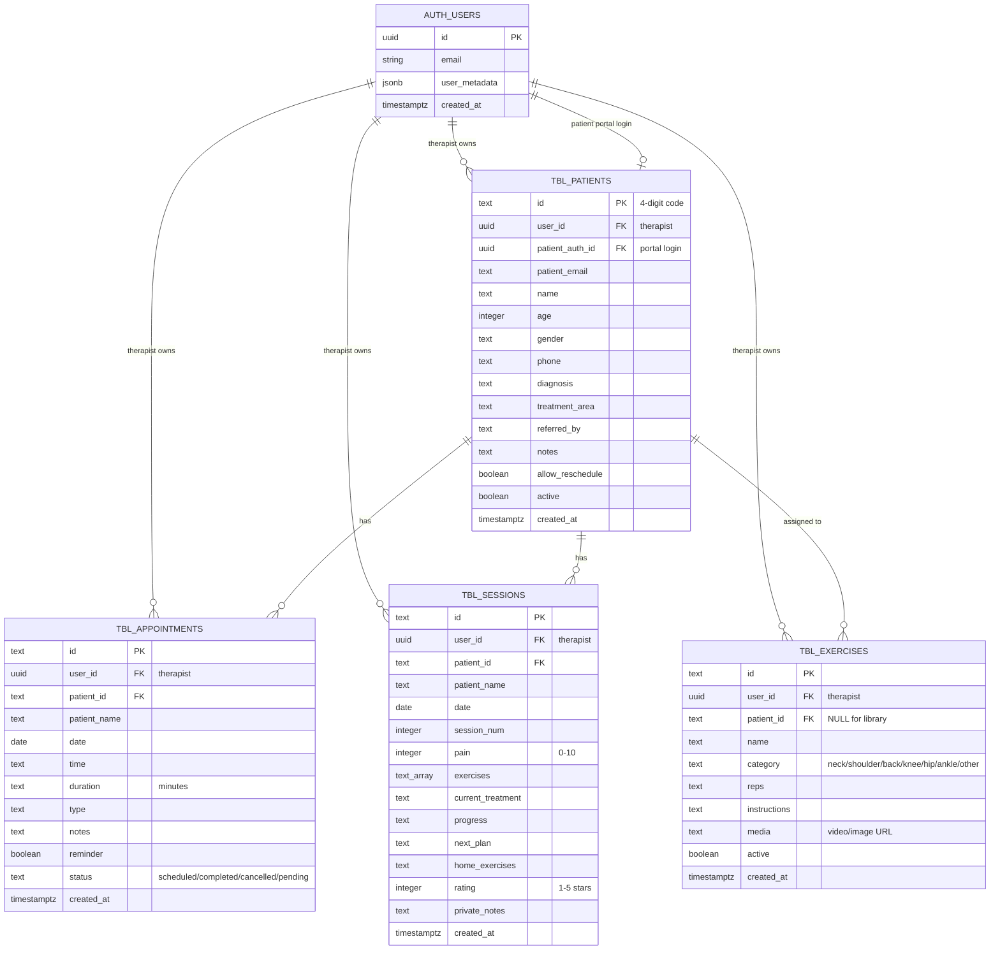

# PhysioTrack Database - Entity Relationship Diagram

---

## Key Relationships

### 1. **Therapist ↔ Patients** (One-to-Many)
- Each therapist (`auth.users`) can have multiple patients
- Each patient belongs to one therapist via `user_id`

### 2. **Patient ↔ Portal Login** (One-to-One - Optional)
- A patient can have a portal login linked via `patient_auth_id`
- Creates entry in `auth.users` with role='patient'

### 3. **Patient ↔ Appointments** (One-to-Many)
- Each patient can have multiple appointments
- Appointments belong to patient via `patient_id`

### 4. **Patient ↔ Sessions** (One-to-Many)
- Each patient can have multiple therapy sessions
- Sessions track progress over time

### 5. **Patient ↔ Exercises** (One-to-Many - Optional)
- Exercises with `patient_id = NULL` are library exercises (available to all patients of that therapist)
- Exercises with `patient_id` set are assigned to specific patient

---

## Data Isolation

**Row Level Security (RLS) ensures:**
- Therapists only see their own patients/appointments/sessions/exercises
- Patients only see their own data via portal login
- No cross-therapist data access

---

## Cascade Behavior

**When a therapist is deleted:**
- All their patients, appointments, sessions, and exercises are deleted (CASCADE)

**When a patient is deleted:**
- All their appointments and sessions are deleted (CASCADE)
- Their assigned exercises are deleted (CASCADE)
- Their auth user link is cleared (SET NULL)

**When a patient auth user is deleted:**
- Patient record remains but `patient_auth_id` is set to NULL (SET NULL)

---

## Indexes

- `idx_patients_user` - Fast lookup of patients by therapist
- `idx_patients_auth` - Unique constraint on patient auth ID
- `idx_appointments_user` - Fast lookup of appointments by therapist
- `idx_appointments_date` - Fast date-based appointment queries
- `idx_sessions_user` - Fast lookup of sessions by therapist
- `idx_sessions_patient` - Fast lookup of patient session history
- `idx_exercises_user` - Fast lookup of exercises by therapist
